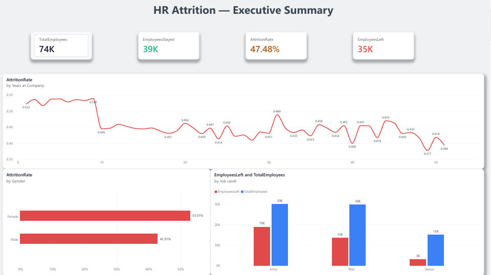
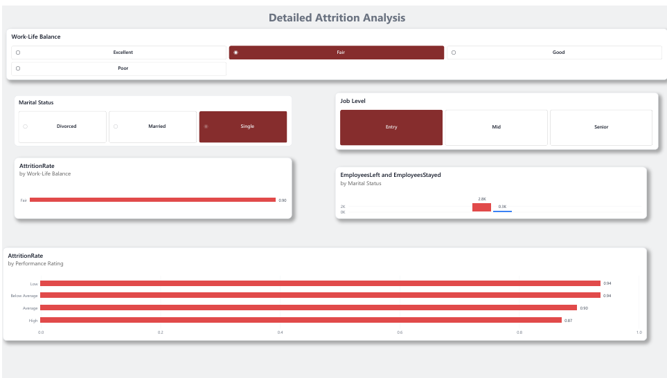
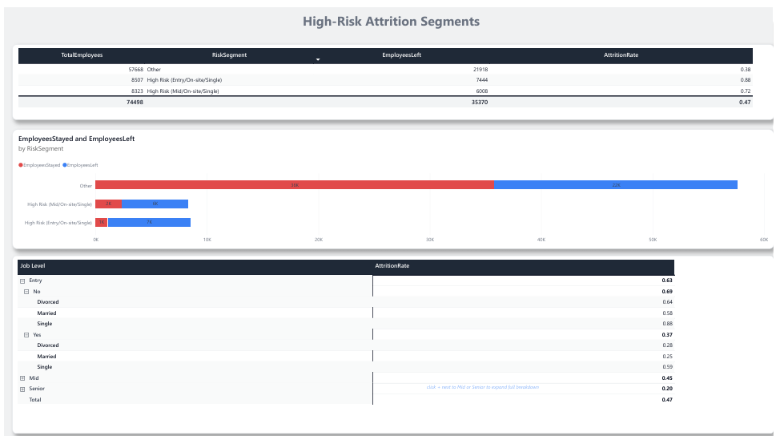
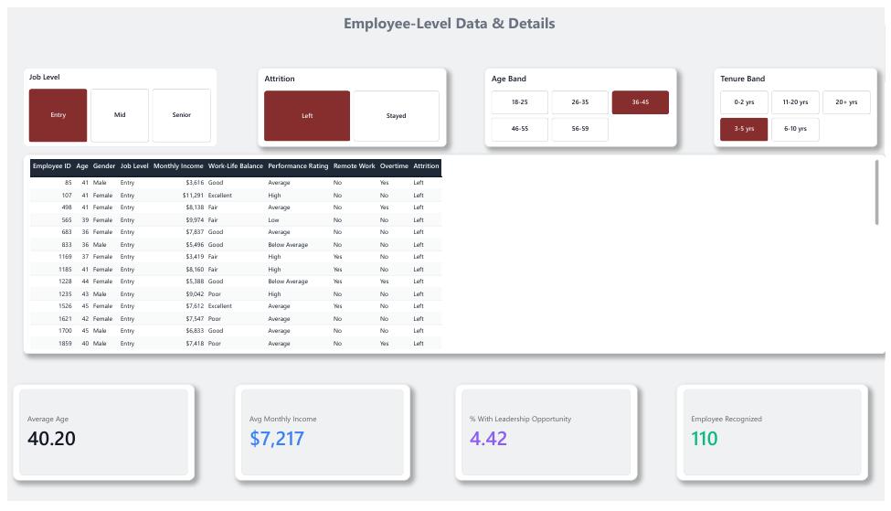

# HR Employee Attrition — Business Analysis Project

End-to-end business analysis of a 74,610-record HR workforce extract: business framing, data profiling, cleaning, KPI development, statistical analysis, an interactive Power BI dashboard, and a consulting-style set of recommendations for HR management.

**Analyst:** Hafeez Khan · Economics graduate | Business Analyst
**Tools:** Excel · SQL · Python (pandas, statsmodels) · Power BI

---

## The business question

An employer across five business functions holds a workforce extract with a recorded employment outcome for every employee. Management knows attrition is high but does not know *where* it sits, *which* groups drive it, or *where intervention would pay*. Retention effort is being spread evenly across a workforce in which the problem is not evenly distributed.

## Headline findings

| Finding | Evidence |
|---|---|
| **The problem is vertical, not horizontal** | Attrition spans 46.8%–48.8% across all five business functions — a 2-point spread. Across job levels it spans 20.3% to 63.3%. Entry-level staff are 40% of headcount and 53.3% of all leavers. |
| **Three factors dominate after controlling for everything else** | Single marital status (adjusted OR 4.68), poor work-life balance (4.43), on-site working (remote OR 0.17). Job level is the strongest structural factor (senior OR 0.08). |
| **The problem is concentrated enough to act on** | Entry-level, on-site, single employees: 87.5% attrition, 11.4% of headcount, 21.0% of all departures. The top three segments hold 27.4% of the workforce and 44.5% of departures. |
| **Career progression is a threshold, not a gradient** | Attrition is flat at ~49% for 0, 1 and 2 promotions, then halves to 24.9% at the third. A "promote more often" policy would change nothing until it crossed that line. |
| **Pay shows no relationship — and that is a data finding** | p = 0.79 in the adjusted model. But median pay is identical at entry, mid and senior level, which no real pay structure produces. The correct conclusion is that the pay field is unusable, not that pay doesn't matter. |
| **The gender gap is real and unexplained** | Women leave at 53.0% vs 42.9%. Gender composition is near-identical across all three job levels and the gap survives every control. Output is a question for HR, not a conclusion. |

Full detail — factor ranking, all tables, confounding tests, regression output, risk segments, negative findings and limitations — is in **[docs/FINDINGS.md](docs/FINDINGS.md)**.

## The dashboard

Four-page Power BI report (`powerbi/HR_Attrition_Dashboard.pbix`), built on the cleaned analysis layer.

### 1. Executive Summary

Headline KPIs, attrition by tenure, and the two structural splits that matter — gender and job level.



### 2. Detailed Attrition Analysis

Cross-filtering across work-life balance, marital status and job level, with performance rating as a control.



### 3. High-Risk Attrition Segments

The segmentation that turns the analysis into a target list: which combinations carry the rate, and how much of total attrition each one actually holds.



### 4. Employee-Level Data & Details

Record-level drill-through with age, tenure, level and outcome filters.



The custom report theme is in `powerbi/theme/hr_attrition_theme.json` — apply it in Power BI Desktop via **View → Themes → Browse for themes**.

## Data quality — the part that shaped the whole project

Profiling before analysis surfaced problems that no cleaning can fix, and they govern how strongly every finding can be stated:

- **32.1%** of records imply the employee started work before age 16 (Age − Years at Company).
- **84.3%** of the file carries contradictory tenure fields — the company is at most 10.7 years old, yet employees record up to 51 years of service.
- **Median pay is identical across all three job levels.**
- **47.5% recorded attrition** indicates a class-balanced extract, not a natural workforce population.

These records were **flagged, not deleted** — removing a third of the file would have biased every comparison more than retaining flagged records does. Relative comparisons between groups remain valid and are the basis of every recommendation; absolute rates are not quotable as organisational facts. This is stated on the report's title page rather than buried in an appendix.

## Repository structure

```
.
├── README.md
├── LICENSE
├── .gitignore
├── data/
│   ├── Emp_attrition_csv.csv          Original source extract, unaltered
│   └── README.md                      Schema and load instructions
├── docs/
│   ├── HR_Attrition_Consulting_Report.docx    Full consulting report
│   └── FINDINGS.md                    Complete analytical findings
├── sql/
│   └── hr_attrition_analysis.sql      Reproducible profiling, cleaning and analysis
├── excel/
│   └── HR_Attrition_Analysis.xlsx     Ten-sheet analysis workbook
├── powerbi/
│   ├── HR_Attrition_Dashboard.pbix    Four-page interactive report
│   └── theme/
│       └── hr_attrition_theme.json    Custom report theme
└── images/
    ├── 01-executive-summary.png
    ├── 02-detailed-attrition-analysis.png
    ├── 03-high-risk-segments.png
    └── 04-employee-level-details.png
```

| File | What it is |
|---|---|
| [`docs/HR_Attrition_Consulting_Report.docx`](docs/HR_Attrition_Consulting_Report.docx) | Consulting report: Executive Summary → Business Problem → Methodology → Data Quality → KPIs → Findings → Factors → Recommendations → Limitations → Management Conclusion |
| [`docs/FINDINGS.md`](docs/FINDINGS.md) | Complete analytical findings — factor ranking, all tables, confounding tests, regression output, risk segments, negative findings, limitations |
| [`excel/HR_Attrition_Analysis.xlsx`](excel/HR_Attrition_Analysis.xlsx) | Ten-sheet analysis workbook: Project Brief, Data Profile, Data Dictionary, Cleaning Log, KPI Summary, Attrition Analysis, Risk Segments, Cross-Tab Analysis, Driver Model, Clean Data. All KPIs and analysis tables are live formulas. |
| [`sql/hr_attrition_analysis.sql`](sql/hr_attrition_analysis.sql) | Reproducible profiling, cleaning and analysis in SQL (PostgreSQL, with portability notes). Every query states its business question and what the result means. |
| [`powerbi/HR_Attrition_Dashboard.pbix`](powerbi/HR_Attrition_Dashboard.pbix) | Four-page Power BI report with DAX measures and cross-page filtering |
| [`data/Emp_attrition_csv.csv`](data/Emp_attrition_csv.csv) | Original source extract, unaltered — 74,610 rows × 24 columns |

## Reproducing the analysis

1. Load `data/Emp_attrition_csv.csv` into PostgreSQL — see [data/README.md](data/README.md) for the `\copy` command and schema notes.
2. Run `sql/hr_attrition_analysis.sql` top to bottom on a clean database. Nothing depends on manual steps in between.
3. Open `excel/HR_Attrition_Analysis.xlsx` to inspect the same analysis as live formulas.
4. Open `powerbi/HR_Attrition_Dashboard.pbix` in Power BI Desktop and repoint the source to your local copy of the data.

## Method

```
Business understanding → Problem definition → Stakeholders → Business questions
   → Data profiling → Data dictionary → Cleaning (10 documented rules)
   → KPI baseline → Univariate analysis → Confounding tests → Logistic regression
   → Risk segmentation → Insights → Recommendations → Limitations
```

**Cleaning:** 112 exact duplicates removed; UTF-8/Windows-1252 encoding corruption repaired in 37,409 values; out-of-range dependent counts nulled and flagged; extreme income flagged, not deleted; missing values excluded pairwise rather than imputed; cross-field integrity flags carried through to the analysis layer. Every rule is documented with volume and justification in the Cleaning Log.

**Analysis:** univariate rates reported alongside share of total leavers throughout — a group can have an alarming rate and still be operationally irrelevant if it is small. Five two-way cross-tabs test each headline difference against a plausible confounder. A logistic regression (n = 72,601, pseudo-R² = 0.289) enters all factors simultaneously, because in a real workforce these variables move together and only simultaneous control can separate them.

**Verification:** all 109 headline figures were independently recomputed from the raw file by a separate script using no shared code with the analysis pipeline. This caught four genuine errors before delivery.

## What this project is not

It does not claim causation. Every relationship reported is an association from a single cross-sectional snapshot with no time dimension, no voluntary/involuntary split, and no manager identifiers. The remote-work finding is the clearest risk: if remote status is granted to employees already likely to stay, the causal reading is backwards — which is why the recommendation is a randomised pilot rather than a rollout.

## License

[MIT](LICENSE) © 2026 Hafeez Khan

---

*Dataset: synthetic HR attrition data used for analysis practice. The data-integrity findings above are genuine properties of the file and are treated as findings rather than worked around.*
